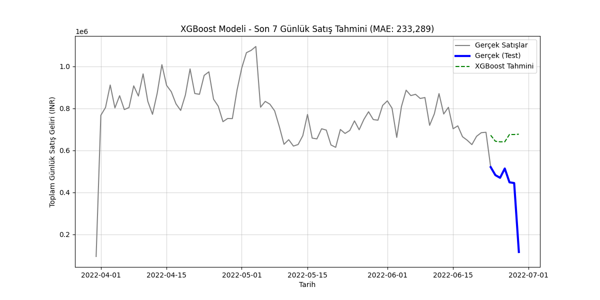

# 💰 E-Ticaret Satış Tahmini (Time Series Forecasting)

## 📌 Proje Özeti

Bu proje, bir e-ticaret platformunun (Amazon Sale Report veri seti) geçmiş satış verilerini kullanarak gelecekteki **günlük toplam satış gelirini** tahmin etmeyi amaçlamaktadır. Projede, klasik zaman serisi yöntemi (Prophet) ile Makine Öğrenmesi (ML) regresyon modeli (XGBoost) karşılaştırılarak en doğru öngörüyü sağlayan model belirlenmiştir.

---

## 🛠️ Teknik Özellikler ve Metodoloji

* **Veri Kaynağı:** Amazon Sale Report Dataset
* **Dönüşüm:** Ham veriden günlük toplam geliri (`y`) hesaplama ve tarih sütununu (`ds`) zaman serisi formatına dönüştürme.
* **Özellik Mühendisliği:** Regresyon modeli için `dayofweek`, `month`, `lag_1` gibi zaman bazlı özellikler çıkarıldı.
* **Modeller:**
    1.  **Prophet:** Klasik, mevsimselliğe dayalı zaman serisi tahmini.
    2.  **XGBoost Regressor:** Güçlendirilmiş karar ağaçları ile regresyon tahmini.
* **Değerlendirme Metrikleri:** MAE (Ortalama Mutlak Hata) ve RMSE.

---

## 📊 Model Sonuçlarının Karşılaştırılması

Yapılan 7 günlük tahmin testinde, Özellik Mühendisliği kullanılan **XGBoost** modelinin saf zaman serisi modelinden daha iyi performans gösterdiği tespit edilmiştir.

| Model | MAE (Ortalama Mutlak Hata) | RMSE (Kök Ortalama Kare Hata) |
| :--- | :--- | :--- |
| **Prophet** | 286,287.23 INR | 319,775.43 INR |
| **XGBoost (Kazanan)** | **233,289.27 INR** | **271,363.48 INR** |

**Sonuç:** XGBoost, tahminlerimizde ortalama **50.000 INR**'den fazla daha düşük hata payı yakalamıştır. Bu durum, zaman bazlı ek özelliklerin tahmin gücünü önemli ölçüde artırdığını göstermektedir.

### XGBoost Tahmin Grafiği

**(Grafik görseli buraya eklenecektir.)**

*Bu görseli eklemek için:* Lütfen **`figures/xgboost_tahmini.png`** dosyanızı GitHub'a yüklediğinizden emin olun ve bu alana Markdown formatında linkini ekleyin.

```markdown

🚀 Proje Çıktıları ve Çalıştırma
Dosya Yapısı
.
├── data/
│   ├── Amazon Sale Report.csv # Ham Veri
│   └── dashboard_verisi.csv # Final Birleştirilmiş Tahmin Verisi
├── figures/
│   ├── prophet_tahmini.png 
│   └── xgboost_tahmini.png # Nihai Grafik
└── notebooks/
    └── 01_veri_yukleme_ve_temizlik.ipynb # Tüm Veri Hazırlık ve Modelleme Kodu
Nasıl Çalıştırılır?
Projeyi çalıştırmak için notebooks/01_veri_yukleme_ve_temizlik.ipynb dosyasını açıp tüm hücreleri sırasıyla çalıştırmanız yeterlidir. Tüm bağımlılıklar (Prophet, XGBoost, Pandas vb.) yüklü olmalıdır.

